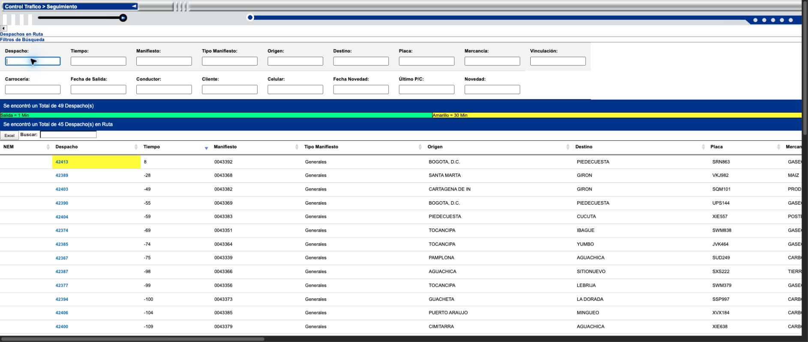
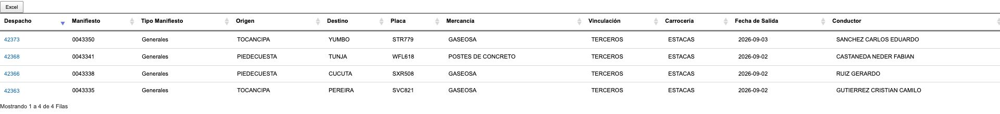
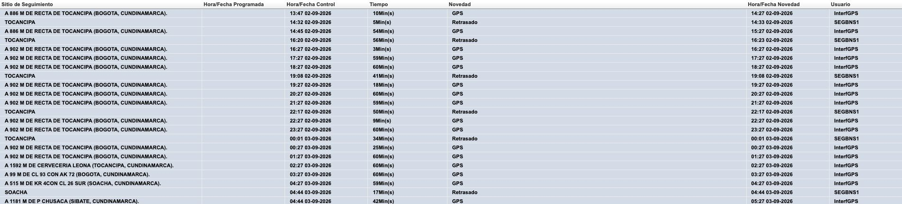
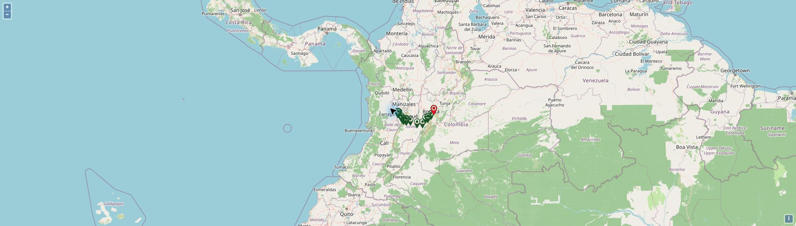
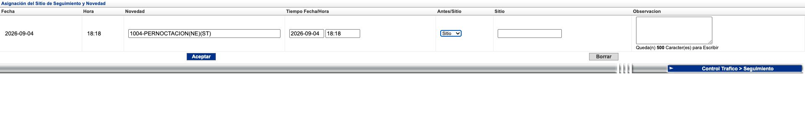

# Avansat Control Tráfico → Seguimiento

Captured reference for implementation in tms-demo. Reviewed in the authenticated Chrome session on **2026-09-04**, using the Transportes MTM administrator view. The original review changed documentation only. A subsequent [local implementation](implementation.md) now covers the confirmed screens and interactions; that record documents its tests, activation requirements and remaining source-parity gaps. It has not been deployed.

The baseline is Avansat's existing functionality. A clearer layout in tms-demo may change presentation, but must preserve the same information, actions, choices, and operational distinctions. Unverified behavior below must not be filled in with invented rules.

## Review coverage

- Opened every trip in the initial list: **44 en route + 4 pending arrival = 48**.
- The live list gained dispatch **42413** during the review. Opened it as well: **49 trip details** captured.
- Captured **1,211 route-plan/history rows** and **433 controller-note rows** across those details. These include historical GPS rows, not just the visible subset under a filter.
- Found maps in **9** trip details and inspected the rendered route map for 42363.
- Opened ordinary, virtual, and final delivery checkpoints. Inspected normal, delayed, and overnight incident variants, changed Antes/Sitio, checked the observation counter, and cleared unsaved form values.
- Tested column filters, combined filters, global search, an empty result, clearing, sorting in both directions, and both Excel exports.
- No report was accepted, no trip was closed or annulled, and no message or RNDC operation was sent. Saving and its downstream effects are therefore not verified.
- Restored the user's original Chrome tab to the tracking queue. Research tabs were closed.

A follow-up review inspected **Configuracion → Alertas Visuales**: the list, all five edit forms, the new-alarm form, the color picker, the deletion list, and related parameter labels. The original Chrome tab was then restored to the user's alarm list. No alarm or parameter was saved or deleted. See [visual-alert configuration](visual-alerts.md).

A further [behavior review](behavior-review.md) captured all 242 listed incidents, all 239 available incident editors, and 1,404 checkpoints; verified incident reloads, location suggestions, observation-length enforcement, arrival fields, and a map popup; and reconciled the manual against the live screens. It found 86 inconsistent Solicita Tiempos values in the incident list. The updates below distinguish these new findings from the original capture.

The [trip review index](evidence/2026-09-04/trip-review-index.json) identifies all 49 records and their coverage. Each has a `trip-<dispatch>.json` evidence file in the same directory. GPS credential rows and long numeric contact/identity values were excluded from saved text captures. Evidence still contains operational names, routes, and notes; it is a local research reference, not seed data for the application.

## Main screen

The breadcrumb is `Control Trafico > Seguimiento`; the content title is `Despachos en Ruta`.

The screen contains:

1. A shared block of 17 column filters.
2. A total count across the two queues.
3. A colored time legend.
4. An en-route queue with its own count, Excel export, global search, sortable table, and displayed-row count.
5. A collapsible `Pendientes por Llegada` queue with its own count, Excel export, global search, sortable table, and displayed-row count.

The initial pending queue was collapsed. The two groups are distinct even when the last note suggests the driver has already unloaded. For example, 42363 remains pending arrival while its latest controller note says `YA CUMPLIO`. Do not infer an official RNDC fulfillment or an automatic trip closure from note text.

### Fields and filters

| Order | En-route column | Shared filter | Pending-arrival column |
| --- | --- | --- | --- |
| 1 | NEM | No | Absent |
| 2 | Despacho | Yes | Yes |
| 3 | Tiempo | Yes | Absent |
| 4 | Manifiesto | Yes | Yes |
| 5 | Tipo Manifiesto | Yes | Yes |
| 6 | Origen | Yes | Yes |
| 7 | Destino | Yes | Yes |
| 8 | Placa | Yes | Yes |
| 9 | Mercancía | Yes | Yes |
| 10 | Vinculación | Yes | Yes |
| 11 | Carrocería | Yes | Yes |
| 12 | Fecha de Salida | Yes | Yes |
| 13 | Conductor | Yes | Yes |
| 14 | Calificación | No | Yes |
| 15 | Cliente | Yes | Yes |
| 16 | Celular | Yes | Yes |
| 17 | Fecha Novedad | Yes | Yes |
| 18 | Último P/C | Yes | Yes |
| 19 | Novedad | Yes | Yes |

Preserve manifest numbers as strings, including leading zeros. `Despacho` is the clickable tracking identifier; it is not the manifest number and must not silently become the existing tms-demo expediente number.

The shared fields are text inputs, including the date and time filters. No date-range picker was observed. `NEM` was blank in the captured records; its meaning and populated behavior are unverified. `Calificación` displayed `Sin Calificar`. A driver-rating field was subsequently confirmed in the separate Llegada form; it was not found inside Seguimiento's checkpoint form. See [arrival and rating](behavior-review.md#delivery-checkpoint-pending-arrival-arrival-and-rating).

### Search, sorting, counts, and export

- The shared plate filter `VKJ982` reduced the en-route queue to one record and pending arrivals to zero.
- Combining origin `BARRANQUILLA` and destination `GIRON` returned four en-route records and zero pending arrivals.
- The en-route global search with a nonmatching string returned zero rows while pending arrivals retained four. The queues' global searches are independent.
- The empty-state message is `No se hallan filas que coincidan con el criterio`. Displayed-row text also reports the total before filtering.
- Clearing filters restores the records. Counts are snapshots of a changing operational list, not fixed constants.
- Clicking the dispatch header produced both ascending and descending numeric order. The accessibility sort label did not consistently match the actual order; use actual displayed/exported order when evaluating parity.
- Tables allow horizontal scrolling. At desktop width, some columns and legend segments are offscreen.
- Excel downloads contain the corresponding queue's filtered rows. An empty search produced a workbook with headers only. The populated en-route workbook had **45 data rows / 19 columns**; the pending workbook had **4 data rows / 17 columns**.
- The populated en-route export followed the displayed dispatch order. Manifest strings retained leading zeros. Blank cells must retain their column positions.
- Export names begin `Despachos En Ruta` and `Pendientes por llegada`, with a date/time suffix.

See [board tests](evidence/2026-09-04/board-tests.json), [sort evidence](evidence/2026-09-04/sort-dispatch.json), and [verified workbook contents](evidence/2026-09-04/excel-export-verification.json). The original downloaded workbooks remain in Downloads; the repository contains their verification summaries and hashes.

### Time and color display

These are configurable alarm records, confirmed in the follow-up review; they must not become fixed constants in tms-demo. The current settings and the tracking legend match:

| Alarm code | Display | Label | Saved color |
| --- | --- | --- | --- |
| 5 | Green | Salida = 1 Min | `33FF99` |
| 1 | Yellow | Amarillo = 30 Min | `FFFF00` |
| 3 | Orange | Naranja = 60 Min | `FF6600` |
| 2 | Red | Rojo = 90 Min | `FF0000` |
| 4 | Violet | Violeta = 120 Min | `9933FF` |

Avansat offers Insertar, Listar, Actualizar, and Eliminar. Name, time, and color are editable. The current set of five is a snapshot, not evidence of a five-alarm limit. Alarm codes are identities, not severity order. See [field limits, color selection, reset behavior, deletion confirmation, and remaining validation gaps](visual-alerts.md).

The list contains signed numbers, including large negative values with thousands separators. The newly added trip 42413 had `Tiempo = 8` and a yellow dispatch cell. Existing negative values changed between the initial and later snapshots.

The formula, reference timestamp, interval boundaries, reset rules, and relationship to special incidents are **not established** by this read-only review. Knowing that the alarm settings are editable does not establish those rules. Do not translate this column into “minutes since last report” or derive its colors from the legend alone. Route-row `Tiempo`, list `Tiempo`, and incident `Tiempo Fecha/Hora` are distinct displays.

## Trip detail

Clicking a dispatch opens `Informacion del Despacho` within the central content frame. The same observed link can be opened as a standalone detail page.

### Información Principal

The detail shows these paired rows:

| Left | Right |
| --- | --- |
| Despacho | Origen |
| Manifiesto | Destino |
| Agencia | Ruta |
| Conductor | Fecha Salida |
| C.C. | Fecha Planeada Llegada |
| Celular | Fecha Creación |
| Telefono | Placa |
| Marca | Configuración |
| Linea | Carrocería |
| Color | Modelo |
| Operador GPS | Usuario GPS |
| Clave GPS | ID GPS |
| URL GPS | — |
| Despacho anulado | — |

The route includes a route number, origin/destination municipality names and codes, and a via description. Date formats differ by field: `HH:mm DD-MM-YYYY` for departure/planned arrival and `YYYY-MM-DD HH:mm:ss` for creation.

GPS credential fields are part of the source screen, but their values are intentionally absent from this reference. Do not seed credentials from the research session. The unlabeled link beside `Despacho anulado` was not activated; its behavior is not established, so it is not evidence for adding an annulment action to this screen.

### Información del Plan de Ruta

| Column | Observed role |
| --- | --- |
| Sitio de Seguimiento | Location or planned checkpoint; pending checkpoints are links |
| Hora/Fecha Programada | Scheduled checkpoint time; can be blank for reported locations |
| Hora/Fecha Control | Time of the reported control event; blank for pending checkpoints |
| Tiempo | Signed minute display ending in `Min(s)`; may have no numeric value |
| Novedad | Incident/status label; blank for pending checkpoints |
| Hora/Fecha Novedad | Recording time for the incident, distinct from control time |
| Usuario | Controller or integration attribution |

The table combines recorded reports with scheduled checkpoints. Locations may repeat, and a reported location need not consume the matching scheduled checkpoint: 42389 has completed CIENAGA reports and a separately pending CIENAGA checkpoint. Preserve event identity and sequence; do not deduplicate by location text.

Observed labels include `Ok`, `Retrasado`, `Pernoctacion`, and `GPS`. Some controller notes display `[NOV-ESP] Pernoctacion`. Blank data is meaningful and must not become a fabricated zero or timestamp.

### Source selectors

Four links appear above the plan: `Seguimiento`, `Interfaz GPS`, `Movil`, and `Todas`.

On trip 42363, the actual result was:

| Selector | Visible route data rows | Controller notes |
| --- | --- | --- |
| Seguimiento | 72, including records labeled GPS | 20 |
| Interfaz GPS | 1, the delivery checkpoint | 20 |
| Movil | 1, the delivery checkpoint | 20 |
| Todas | 72 | 20 |

Counts here exclude table headers. The source's rendered DOM classified GPS-labeled historical rows in the same group as manual tracking rows in this trip. These selectors therefore cannot be reconstructed simply by filtering `Novedad === GPS`. Controller notes were not filtered. Preserve this finding as a source behavior to resolve before final parity certification; do not silently introduce a different interpretation.

See [source-filter evidence](evidence/2026-09-04/source-filters-42363.json).

### Vehicle route map

Nine details contained `Ver recorrido del vehículo` and a rendered map. The reviewed map shows historical position markers, OpenStreetMap attribution, zoom in/out, reset rotation, and attribution controls. The map for 42363 rendered a route between the Bogotá area and Pereira.

The capture confirms the map and markers. A follow-up [marker interaction](behavior-review.md#map-marker-interaction) verified a popup with event number, date/time, location description, speed, and a close control. Automatic refresh cadence and the integration contract that supplies positions remain unverified. Do not invent a new GPS provider integration or a new driver-facing mobile flow from the presence of these records.

### Información de Notas de Controlador

The columns are `Sitio de Seguimiento`, `Novedad`, `Observación`, `Fecha`, and `Usuario`. Notes are shown newest first in the reviewed cases. Observation text can be multiline and include special-incident labels.

The detail finishes with `Observaciones Generales`, `Medios de Comunicacion`, and `Protecciones Especiales`. Preserve these separate fields. They are not additional controller notes.

## Registering a checkpoint report

Opening a pending checkpoint shows the same trip header, a `Sitio de Seguimiento` heading for the selected checkpoint, and `Asignación del Sitio de Seguimiento y Novedad`.

| Field | Observed behavior |
| --- | --- |
| Fecha | Current date, read-only |
| Hora | Current time, read-only |
| Novedad | Searchable text/autocomplete, maximum length 50, selected option includes code and flags |
| Tiempo Fecha/Hora | Additional editable date and time, conditional on the incident |
| Antes/Sitio | `Antes` / `Sitio`; ordinarily defaults to Antes |
| Sitio | Text/autocomplete field, maximum length 50; editability varies by checkpoint and form reload |
| Observacion | Multiline input with a 500-character remaining counter |
| Aceptar | Save/accept action; deliberately not submitted in this review |
| Borrar | Resets current form values; does not delete an existing report |

Typing four characters in Observacion changed the remaining counter from 500 to 496. Borrar cleared the observation and site and restored Antes. The selected incident remained the current default after its form reload. The follow-up test entered 501 characters and another key: the value was trimmed to 500 and the counter showed zero. Other input methods and server-required fields remain unverified.

### Incident variants

| Selected incident | Additional date/time fields |
| --- | --- |
| `2-OK(GA)` | Absent |
| `3-RETRASADO(GA)(ST)` | Present |
| `1004-PERNOCTACION(NE)(ST)` | Present |
| `1003-COMENTARIO(NE)(MA)` | Absent |
| `7-ALIMENTACION(GA)(ST)` | Present |

Selecting an incident reloads the form. A follow-up test confirmed that selecting Comment clears an unsaved observation and location, resets Sitio to Antes, and retains the newly selected incident. GA means Genera Alerta; ST means Solicita Tiempos; NE means Novedad Especial; MA means Mantiene Alarma/Alerta. Their configured identities are established; full alarm persistence and timing effects remain unverified.

Searches for `re` and `pe` exposed many additional catalogue entries, including mobile and GPS-related incidents. [Incident search evidence](evidence/2026-09-04/incident-searches.json) preserves the returned labels. The follow-up captured the complete visible master catalogue, **242 entries**, plus all **239 available edit definitions**. The list and editor disagree on Solicita Tiempos for 86 entries; tested reporting forms agree with the editor. Master-list membership does not prove report-lookup eligibility. Some labels have source encoding defects; preserve code identity and source provenance. See [incident reconciliation](behavior-review.md#incident-definitions-and-flags).

### Checkpoint variants

- **Ordinary checkpoint, CIENAGA / 42389:** Antes and Sitio are available; the location field starts blank and editable.
- **Virtual checkpoint, FUNDACION / 42389:** the initial location is prefilled and read-only; Antes and Sitio are available. After choosing Retrasado or Ok, the reloaded form retained the checkpoint heading but presented a blank editable location. Both stages are captured; do not flatten them into a single inferred rule.
- **Final delivery checkpoint, Lugar Entrega / 42363:** only Sitio is available, and the location is fixed to Lugar Entrega and read-only.
- The location field's earlier `ci` and `cie` queries returned no choices. The follow-up verified matching suggestions for `CIENA`, `CIENAGA`, and `cienaga`; one-to-four-character test queries returned none. Suggestions include descriptive places beyond the checkpoint master catalogue. See [lookup behavior and catalogue distinction](behavior-review.md#checkpoints-and-the-reporting-location-lookup-are-different).

Evidence: [ordinary](evidence/2026-09-04/checkpoint-form.json), [virtual](evidence/2026-09-04/virtual-checkpoint-form.json), [normal incident](evidence/2026-09-04/checkpoint-ok.json), [delayed](evidence/2026-09-04/checkpoint-delayed.json), [overnight](evidence/2026-09-04/checkpoint-overnight.json), and [final delivery](evidence/2026-09-04/arrival-form-42363.json).

## Relationship to tms-demo

Inspected the repository at commit `4092fd3`. Existing unrelated work under `docs/demo/` was left intact.

| Existing area | Useful foundation | Gap for this feature |
| --- | --- | --- |
| `apps/web/app/components/app-shell.tsx` | Existing navigation and visual shell | No Control → Seguimiento entry |
| `apps/web/app/expedientes/` | Dispatch list and document workspace | Not the two Avansat tracking queues or tracking detail |
| `apps/web/convex/schema.ts`: expedientes, fleet, customers, documents | Trip identity, vehicle/driver/customer references, document numbers | Separate tracking identifier, queue membership, planned checkpoints, actual reports, timer inputs, and GPS history |
| `expedienteEvents` | General chronological audit/event records | Does not carry all scheduled/control/incident/source/checkpoint fields |
| `expedienteNovelties` | General open/resolved operational issues | Not equivalent to Avansat's coded tracking incidents and controller-note history |
| `controlPoints` | Existing RNDC-oriented master data | Do not assume its code namespace equals Avansat route/checkpoint codes |
| `apps/web/app/expedientes/components/draft-stage-forms.tsx` | A `Requiere seguimiento` input exists | A flag is not evidence that this tracking workflow exists |
| `apps/rndc-api` and `packages/rndc-core` | Official RNDC operations and evidence | Tracking UI must not bypass the established XML/SOAP boundary |

Earlier July dispatch design documents explicitly excluded Control Tráfico. This reference records the newly requested feature study for later implementation; it does not alter document emission, empty-manifest behavior, or those existing workflows.

### Recommended implementation boundary

Add Control → Seguimiento as its own operator workspace, using the existing tms-demo presentation and existing trip references. Reproduce the two queues, detail, checkpoint reporting, source selectors, history, map, and Excel behavior above. Include the existing visual-alert configuration as a dependency of tracking. Keep the tracking lifecycle distinct from official document states.

The future data model needs explicit identities for the tracking dispatch, route plan, scheduled checkpoint occurrence, actual report, incident catalogue entry, source, controller, and visual alarm. An alarm has an identity, editable name, time in minutes, and color. Preserve scheduled time, control time, incident time, and special-incident date/time separately. Link reports to checkpoints where the source supports it without deduplicating repeated places.

Use Convex for the application's records and history. Official RNDC actions, if a verified source transition requires any, remain behind the existing Express/core boundary. Prevent duplicate report submissions internally. These are implementation safeguards, not additional operator features.

A screenshot-only clone would omit behavior. Adding general fleet-management features would expand scope. The recommended boundary is functional parity with the captured tracking workflow, presented consistently with tms-demo.

## Acceptance checklist for later implementation

### Confirmed behavior to reproduce

- [ ] Control → Seguimiento opens both independently counted queues.
- [ ] En-route has 19 columns; pending arrival has 17, with the exact field distinctions above.
- [ ] All 17 shared text filters are present, combine correctly, and affect both queues.
- [ ] Global searches remain local to each queue; clearing and zero-result states work.
- [ ] Sorting works on the displayed data and export order, including signed time values.
- [ ] Visual alarms can be listed, created, edited, and deleted through their existing configuration scope.
- [ ] Tracking uses the saved alarm catalogue for its legend and the verified alert evaluation; neither five records nor the current names, times, or colors are hard-coded.
- [ ] Alarm form limits, color selection, form reset, and deletion confirmation preserve the observed distinctions.
- [ ] Both Excel exports respect filters and preserve manifest zeros and blank column positions.
- [ ] A dispatch opens the matching detail, not a similarly numbered manifest or expediente.
- [ ] Main information, scheduled/actual checkpoint history, notes, and final information fields remain separate.
- [ ] Repeated locations and blank scheduled/control timestamps survive intact.
- [ ] All four source selectors are present; notes retain their observed independent behavior.
- [ ] GPS history can be displayed on the existing-kind route map when available.
- [ ] Ordinary, virtual, and final delivery checkpoints show their distinct choices.
- [ ] Ok omits special date/time; Retrasado and Pernoctación show it.
- [ ] Observation counter, incident reload, and Borrar behavior are reproduced and tested.
- [ ] A newly appearing trip becomes visible without a hard-coded list size.
- [ ] Desktop and mobile layouts expose the same fields and actions without adding functionality.

### Evidence still needed before claiming full functional parity

- [ ] Exact list-time calculation, color interval boundaries, and timer reset/suspension rules.
- [ ] Alarm save validation, duplicate/overlapping times, ordering, empty configuration, deletion effects, and propagation of saved changes to tracking.
- [x] Complete visible incident master catalogue, flag identities, available edit definitions, checkpoint master catalogue, and representative location matching.
- [ ] Full report-lookup eligibility and location dataset; remaining incident-list/editor discrepancies beyond tested examples.
- [ ] Acceptance validation, error messages, and successful save/read-back for each relevant variant in a controlled test environment.
- [ ] Exact queue transition and downstream effects from controlled report/arrival acceptance; separate delivery, pending-arrival, arrival, and rating fields are now established.
- [ ] Behavior after repeated acceptance, retries, and concurrent reports.
- [ ] Scope of permissions beyond the administrator view reviewed here.
- [ ] Source-filter classification for GPS/mobile records; resolve the observed 42363 grouping before changing its semantics.
- [x] Marker popup fields and zoom interaction.
- [ ] GPS ingestion contract, missing/unavailable position behavior, and refresh cadence.
- [ ] Meaning and behavior of NEM, saved rating effects, and the unlabeled annulled-dispatch control.

These are verification gaps, not approval requests and not permission to invent behavior. The [follow-up gap register](behavior-review.md#what-remains-and-how-to-resolve-it) identifies the evidence required for each remaining question. Production-save parity has not been tested.
