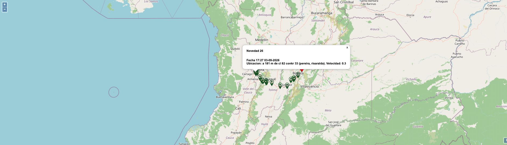

# Resolving the remaining Seguimiento questions

Follow-up research on **2026-09-04, America/Bogota**. The capture timestamps cross midnight UTC. This review extends the [tracking reference](README.md) and [visual-alert reference](visual-alerts.md). It changes documentation only.

Completion criteria for this review: inspect the available incident definitions and checkpoint catalogue; reconcile conditional fields against the reporting form; inspect arrival and rating entry points; exercise unsaved input and map behavior; preserve contradictory evidence; and identify precisely which remaining questions require a controlled save test or source access.

## Findings that change the implementation reference

### Incident definitions and flags

`Tablas > Novedades > Listar` returned **242 distinct incident codes**. `Actualizar` exposed **239 editable definitions**, all of which were opened and captured. The three listed records absent from the update results were:

| Code | Description |
| --- | --- |
| 1 | Tiempo Llegada P/C |
| 9998 | Robo (Mintra) |
| 9999 | Inicia PERNOCTACION |

Their absence does not prove why they cannot be edited. Preserve the distinction rather than inventing a system-record policy.

The edit forms establish the labels behind the abbreviations. The manual, page 419, describes their intended effects:

| Flag | Configuration label | Documented meaning | Live verification |
| --- | --- | --- | --- |
| GA | Genera Alerta | Produces an alert when the programmed time is reached | Identity confirmed; timing algorithm not established |
| ST | Solicita Tiempos | Requests a date and time | Conditional fields directly tested |
| NE | Novedad Especial | Highlights a special incident in tracking | Identity and special labels confirmed; full color interaction not tested |
| MA | Mantiene Alarma / Mantiene Alerta | Retains the alarm color for continued monitoring | Identity confirmed; persistence/reset effects not tested |

**86 of the 239 editable incidents disagree with the list, exclusively in Solicita Tiempos.** The other three flags match for every comparable record. Both versions are preserved; a list-only import would be unreliable.

| Incident | ST in list | ST in editor | Actual report form |
| --- | --- | --- | --- |
| 2 — Ok | No | No | No additional time fields |
| 3 — Retrasado | Yes | Yes | Additional date/time fields |
| 7 — Alimentacion | Yes | Yes | Additional date/time fields |
| 1003 — Comentario | Yes | No | No additional time fields |
| 1004 — Pernoctacion | No | Yes | Additional date/time fields |

The reporting form agrees with the editor in these tested cases, including the two conflicting examples. This resolves which behavior to reproduce for those incidents; it does not prove all 86 discrepancies have the same cause.

The full master catalogue is not proven to be the selectable report catalogue. Searching `alimentacion` returned code 7, while the master list also contains a separate code 20131 with the same name. Searching `com` returned nine suggestions, including code 1003; entering `1003` alone returned none. Do not merge duplicate names or assume every master record is offered in every reporting context.

Evidence: [complete list](evidence/2026-09-04/behavior-review/incident-catalogue.json), [all 239 definitions](evidence/2026-09-04/behavior-review/incident-definitions.json), [86 discrepancies and three missing definitions](evidence/2026-09-04/behavior-review/incident-comparison.json), [Comment form](evidence/2026-09-04/behavior-review/report-comment-reload.json), [meal-stop form](evidence/2026-09-04/behavior-review/report-meal-stop.json).

### Checkpoints and the reporting location lookup are different

`Rutas y P.Control > Puestos de Control > Listar`, searched with an empty Texto field, returned **1,404 records**: 1,262 Virtual and 142 Fisico, all displayed as Activo. There are 265 names shared by more than one code. The full screen has Código, Descripción, Dirección, Teléfono, Encargado, Puesto, and Estado; the saved reference retains only code, name, kind, and status.

The report's `Sitio` autocomplete includes descriptive phrases such as `A DELANTE DE CIENAGA`, as well as `CIENAGA`. It cannot safely be replaced with a picker restricted to the checkpoint master data.

Observed matching behavior:

- `c`, `ci`, `cie`, `cien`, and `CI` produced no visible suggestions.
- `CIENA`, `CIENAGA`, and `cienaga` produced the same ten suggestions.
- These examples support a five-character minimum and case-insensitive matching for this lookup. They do not establish every matching rule or a universal ten-result limit.
- Suggestions can match inside the description and can repeat. Keep the observed order and distinct records.
- Selecting `CIENAGA` populated the location field with ` CIENAGA `, including surrounding spaces, without changing Antes/Sitio or reloading the form.

The lookup now has a working, repeatable example. Its complete backing dataset and eligibility rules remain unknown.

Evidence: [checkpoint catalogue](evidence/2026-09-04/behavior-review/checkpoint-catalogue.json), [lookup queries and results](evidence/2026-09-04/behavior-review/report-input-checks.json).

### Unsaved form behavior and the observation limit

Before selecting Comment, the ordinary checkpoint form contained an observation, `Sitio` position, and `CIENAGA` location. Selecting `1003-COMENTARIO(NE)(MA)` reloaded the form and:

- Kept the newly selected incident.
- Reset Antes/Sitio to Antes.
- Cleared the location and observation.

This is a verified loss of unsaved values on incident selection, independent of pressing Aceptar. Do not silently claim that Avansat preserves those values.

Entering 501 characters and then another character in Observacion resulted in **500 retained characters** and `Queda(n) 0 Caracter(es) para Escribir`. This verifies enforcement after the tested key event, not every paste/input method or server-side acceptance path. Borrar subsequently cleared the temporary values. No report was submitted.

Evidence: [before/after incident reload](evidence/2026-09-04/behavior-review/report-comment-reload.json), [character-limit result](evidence/2026-09-04/behavior-review/report-input-checks.json), [reset read-back](evidence/2026-09-04/behavior-review/report-reset.json).

### Delivery checkpoint, pending arrival, arrival, and rating

The live `Control Trafico > Llegada` screen offers both en-route and pending-arrival queues. Opening a pending dispatch there shows a separate arrival form, not the Seguimiento checkpoint form.

The arrival form for 42363 contains:

- Dispatch information and planned arrival.
- Actual arrival day, month, year, hour, and minute, initially the current date/time.
- Arrival observations.
- Driver rating: Pésimo = 1, Malo = 2, Regular = 3, Bueno = 4, Excelente = 5, plus an empty selection.
- Separate rating observations. The rating and its observations have visible required-field asterisks; successful validation was not exercised.
- Aceptar and Borrar. No arrival was accepted.

Dispatch **42387** provides an independently observed transition: it was previously en route with a GPS report, then appeared in pending arrivals with `Lugar Entrega`, incident `Ok`, and report time `2026-09-04 18:56:00`. The system was being used by its operators during this review. We observed the before/after state, not the operator's exact submission or its internal effects.

The manual, pages 245–246, describes arrival as a separate confirmation that records arrival and removes the dispatch from the en-route list. Pages 255–257 describe a separate rating workflow and its RIT setting. The live arrival form confirms the fields, and the existing RIT parameter is enabled. The separate Calificación entry was opened, but its page stalled the research browser; no rating was changed or transmitted.

This resolves the distinction between reporting at delivery, pending arrival, recording arrival, and driver rating. It does **not** establish an RNDC fulfillment action, the complete queue-state algorithm, or all downstream effects of accepting arrival. Those remain separate verification requirements.

Evidence: [arrival queue](evidence/2026-09-04/behavior-review/arrival-board.json), [arrival form](evidence/2026-09-04/behavior-review/arrival-entry-42363.json), [later pending queue](evidence/2026-09-04/behavior-review/timer-board-a.json), [earlier 42387 detail](evidence/2026-09-04/trip-42387.json).

### Map marker interaction

The route map supports a popup on a position marker. The inspected popup contained an event number (`Novedad 26`), date/time, location description, speed, and a close control. The zoom control was also exercised. The reviewed position was historical, not proof of the vehicle's current location.

Evidence: [popup text and capture time](evidence/2026-09-04/behavior-review/map-popup.json). GPS ingestion, refresh policy, missing-position handling, and integration failure behavior remain unverified.

## Timer findings and contradictions

The configuration values and tracking legend were already reconciled. Further research does not justify turning those labels into a guessed interval algorithm.

- The live legend says `Min`; the manual's alarm section, pages 370–374, calls the same field seconds. The manual therefore cannot settle the unit or interval calculation against the live implementation.
- The earlier yellow dispatch with Tiempo 8 conflicts with a simplistic interpretation that yellow starts only after 30.
- At 19:03:35 local time, trip 42389 had Tiempo -26 despite its latest report at 18:39. This rules out the simple formula “elapsed minutes since the displayed latest report.”
- In the initial reload comparison, all 47 trips with unchanged displayed report information gained one or two units after reloading. This is consistent with a minute-based clock with record-specific calculation/rounding, but does not prove its reference timestamp.
- The same open page showed unchanged rows over the first 59-second observation. After reloading, a further 130-second passive observation also retained identical timer rows and pending arrivals. No automatic update occurred during those observations; this does not exclude a longer refresh interval. A missing HTML refresh tag is not proof that automatic refresh is absent.
- The current 42403 detail contains actual control timestamps and planned checkpoints, but does not expose the special incident's stored future date/time. Its board value cannot be derived reliably from these visible fields alone.

`NEM` remained blank and had no explanatory title or abbreviation in the inspected header. It remains unidentified.

Evidence: [timer comparisons](evidence/2026-09-04/behavior-review/timer-comparison.json), [first board capture](evidence/2026-09-04/behavior-review/timer-board-a.json), [before reload](evidence/2026-09-04/behavior-review/timer-board-without-reload.json), [after reload](evidence/2026-09-04/behavior-review/timer-board-b.json), [longer passive observation](evidence/2026-09-04/behavior-review/timer-passive-observation.json), [current 42403 detail](evidence/2026-09-04/behavior-review/timer-trip-42403.json).

## What remains and how to resolve it

| Question | Current status | Evidence required to close it |
| --- | --- | --- |
| Incident codes and flag identities | Complete visible master list; all available editors inspected | No additional evidence for these inventories |
| ST conditional form behavior | Verified for five incident examples; list defects identified | Additional report contexts for the remaining conflicting definitions |
| Full selectable incident/location datasets | Search behavior demonstrated; eligibility not known | Source lookup rules or controlled fixtures covering excluded/duplicate entries |
| Reload/reset and 500-character behavior | Verified without accepting a report | Saved validation and alternate input methods remain separate |
| Delivery versus arrival and rating | Separate forms and real queue transition observed | Controlled acceptance/read-back for exact transition and downstream effects |
| Alarm thresholds, timer reference, resets and MA/NE interaction | Partly constrained; documentation conflicts with live UI | Read access to the calculation or controlled trips covering before/at/after each threshold and incident transition |
| Alarm create/update/delete validation and propagation | Forms already reviewed; values unchanged | Controlled configuration tests, including equal times, invalid input, deletion, and empty configuration |
| Duplicate submission, retries, concurrent controllers | Not exercised on production records | Isolated save/retry/concurrency tests with read-back |
| Roles and permissions | Administrator view only | Permission definitions or non-production accounts for the relevant roles |
| GPS/mobile source classification and ingestion | Existing source-selector anomaly retained | Source classification rules and representative integration records |
| Map popup | Verified | Refresh, failure, and missing-position cases still require evidence |
| NEM and the unlabeled annulled-dispatch control | Unidentified | Source definition or a representative populated/read-only example |

These are access and verification needs, not approval requests. Inventing defaults for these cases would undermine the requested functional parity. No live reports, arrivals, ratings, incidents, alarms, parameters, or official records were saved or deleted in this research.

Research tabs were closed at the end; the user's original Avansat tab remains available. Application code and unrelated `docs/demo/` work were unchanged.

## Manual provenance

The manual was reached through Avansat's own `Manuales > Manual` menu and downloaded through Chrome. Its interactive counterpart identifies itself as 2025 and repeats the same tracking explanation. The PDF has 469 pages. Page 419 was rendered and visually inspected in addition to text extraction. Source address, file hash, and reviewed page references are recorded in [manual provenance](evidence/2026-09-04/behavior-review/manual-source.json). The full PDF remains in Downloads; it is not copied into the repository.
