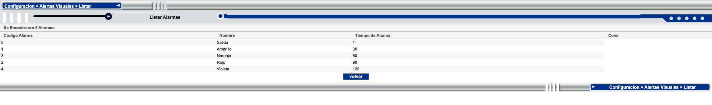
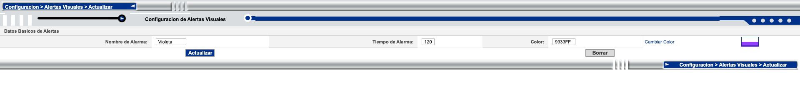
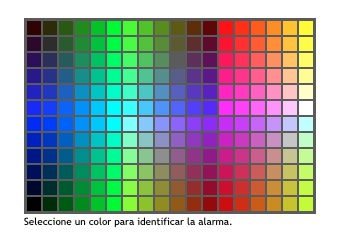
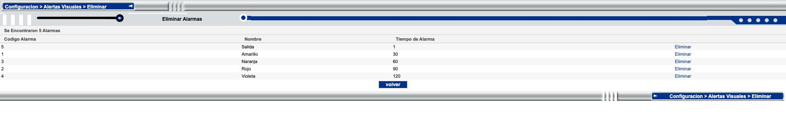

# Avansat visual-alert configuration

Follow-up to the [Seguimiento reference](README.md), inspected on **2026-09-04, approximately 18:36–18:42 Colombia time**, in the same authenticated administrator session.

Visual alerts are an editable catalogue under `Configuracion > Alertas Visuales`. Their current names, minute values, and colors exactly match the legend in `Control Trafico > Seguimiento`. This configuration is part of the requested functional scope. Reproducing only the current legend would omit an existing capability.

The review opened all five edit forms, the create form, the palette, and the deletion list. It tested unsaved color selection and form reset. No Insertar, Actualizar, or deletion operation was submitted. A final read-back matched all five original records.

## Current catalogue

| Code | Name | Alarm time, minutes | Stored color | Display color |
| --- | --- | --- | --- | --- |
| 5 | Salida | 1 | `33FF99` | Green |
| 1 | Amarillo | 30 | `FFFF00` | Yellow |
| 3 | Naranja | 60 | `FF6600` | Orange |
| 2 | Rojo | 90 | `FF0000` | Red |
| 4 | Violeta | 120 | `9933FF` | Violet |

The observed order follows increasing alarm time, not code order. The sort rule after edits, and ties, remain untested. Names and colors are editable independently; do not infer a color from the name or a severity from the record code. Insertar means the current five records cannot be treated as a fixed enum; the maximum supported number was not established.

Evidence: [initial list](evidence/2026-09-04/visual-alerts/list.json), [final list](evidence/2026-09-04/visual-alerts/list-final.json), and [tracking comparison](evidence/2026-09-04/visual-alerts/tracking-comparison.json).

The Color column looks empty in this source list. Its cells contain saved hex values in `background-color` without a leading `#`; Chrome computes transparent backgrounds. The edit form and tracking legend do display colors. Preserve the stored color and render a valid swatch in tms-demo; the blank list cells are not evidence of absent configuration.

## Navigation and actions

| Menu action | Observed screen | Available action |
| --- | --- | --- |
| Insertar | Three empty fields | Insertar saves; Borrar resets the form |
| Listar | Code, name, time, color; total count | volver |
| Actualizar | Code, name, time; clickable code | Open the selected alarm's prefilled editor |
| Eliminar | Code, name, time; per-row Eliminar link | Per-record deletion with a confirmation handler; volver |

Service identifiers observed through actual menu navigation are 3214, 3215, 3216, and 3217 respectively. They describe source navigation, not a required route design for tms-demo. Do not use captured mutation URLs as read-only links.

Listar's volver calls browser history back one entry; the deletion list calls back two entries. Create and edit forms showed no separate cancel/back button. Navigation away discarded the unsaved work in this review.

## Create and edit fields

Both forms use the heading `Configuracion de Alertas Visuales` and section `Datos Basicos de Alertas`.

| Field | Source control | Maximum length | Initial value |
| --- | --- | --- | --- |
| Nombre de Alarma | Editable text, `nom_ala` | 10 | Empty for create; saved name for edit |
| Tiempo de Alarma | Editable text, `tiempo` | 3 | Empty for create; saved minute value for edit |
| Color | Editable text, `color` | 7 | Empty for create; saved hex string for edit |

There is no editable code field. Code assignment on creation is unverified. There are no per-trip, customer, route, channel, sound, or notification fields in these forms.

The time input is a text field; the UI does not prove a numeric range of 0–999, positive-only validation, uniqueness, or whether decimal/negative input can be saved. None of the three fields has a native HTML required attribute. Both save buttons invoke the source's validation handler, so absence of that attribute is not evidence that empty input is accepted. Server validation and resulting messages remain untested.

All five edit forms were captured: [Salida](evidence/2026-09-04/visual-alerts/update-5.json), [Amarillo](evidence/2026-09-04/visual-alerts/update-1.json), [Naranja](evidence/2026-09-04/visual-alerts/update-3.json), [Rojo](evidence/2026-09-04/visual-alerts/update-2.json), and [Violeta](evidence/2026-09-04/visual-alerts/update-4.json). See also the [create form](evidence/2026-09-04/visual-alerts/create.json).

### Color selection and Borrar

`Cambiar Color` and the adjacent swatch open the same palette popup titled `Alarmas`, with the prompt `Seleccione un color para identificar la alarma.` Its image map contains **216 selectable colors**. Selection supplies a six-character hex value without `#` to the parent form and closes the popup.

On Salida, selecting red changed the unsaved Color field from `33FF99` to `FF0000`. The saved default remained `33FF99`. Clicking Borrar restored `33FF99`. The create form was filled with sample values and Borrar returned all three fields to empty. Therefore Borrar means reset to the form's loaded defaults, not deletion of the saved alarm.

Evidence: [palette entries](evidence/2026-09-04/visual-alerts/color-picker.json), [selection and edit reset](evidence/2026-09-04/visual-alerts/color-selection-reset.json), and [create reset](evidence/2026-09-04/visual-alerts/create-reset.json).

### Deletion

The separate Eliminar list exposes one deletion link per alarm. Each rendered link's handler asks `Desea Eliminar la Alarma`, continuing only when confirmed. This handler was inspected without activating the link. No deletion dialog or successful deletion was exercised. Recovery, constraints on deleting Salida or the last alarm, and downstream effects are unknown.

See the [deletion-list capture](evidence/2026-09-04/visual-alerts/delete-list.json).

## Relationship to Seguimiento

The current catalogue and tracking legend match on all five names, times, and colors. The tracking legend correctly prefixes color values with `#`. This provides evidence for treating the catalogue as a tracking dependency. Applying a saved setting change and observing the resulting board was not tested, so reload timing and propagation behavior remain unknown.

At the later board capture, all 47 en-route dispatch cells were white. Forty-six rows had negative Tiempo values; one had a blank Tiempo. The four pending-arrival dispatch cells were also white. In the earlier review, dispatch 42413 had Tiempo 8 and a yellow cell; by this review it had Tiempo -228 and a white cell. The operational list was changing during the study. These observations do not establish a complete interval algorithm, reset trigger, or reference timestamp.

Do not assume that a label such as Amarillo = 30 Min means yellow begins exactly at 30, or that all negative/blank times share a universal rule. The list's Tiempo, route-row Tiempo, and special-incident date/time remain separate concepts until their calculation and relationship are verified.

For later implementation:

- Store each visual alarm's identity, editable name, minute value, and color.
- Preserve the existing list/create/edit/delete capability and distinguish reset from deletion.
- Build the legend from the saved catalogue. Keep identity separate from ordering and display values.
- Use the same catalogue in the alert calculation once the source's interval rules are confirmed.
- Make layout and color presentation clearer while preserving the source's available choices.

## Related parameters inspected

`Configuracion > Parametros` was inspected for relevant labels and values. No setting in the inspected field list explicitly explained the tracking timer calculation or interval boundaries. Credential values were not captured.

| Related parameter | Current value | Scope of evidence |
| --- | --- | --- |
| Restringir Plan de Ruta y Salida Importar Completo | Unchecked | Import-related switch; effect not exercised |
| Activar Llegada Automatica en Importar Completo | Unchecked | Import-related arrival switch; effect not exercised |
| Transmitir información de Despachos Finalizados y Calificaciones a la RIT | Checked | Separate integration setting; nothing transmitted |
| Listar manifiestos para radicar cumplido RNDC sin cumplir en Avansat | Unchecked | Separate fulfillment listing option |
| Cumplido inicial por Integrador GPS | Unchecked | Separate integration option; effect not exercised |
| Valor Multa por Puesto de Control | 50000 | Configured amount; no penalty action observed in Seguimiento |
| Observaciones Plan de Ruta | Reporting instructions for all checkpoints | Default text exists; its propagation was not tested |

These are context, not evidence for adding automatic arrivals, penalties, RIT transmission, or RNDC actions to Seguimiento. Their behavior would need separate source verification if an actual tracking transition depends on them.

Evidence: [field-label inventory without unrelated values](evidence/2026-09-04/visual-alerts/parameter-field-index.json) and [related values with contact numbers omitted](evidence/2026-09-04/visual-alerts/related-parameters.json).

## Remaining verification

- Successful create/update/delete and their validation messages in a controlled environment.
- Allowed time and color formats; duplicate names or times; overlapping/equal thresholds.
- Ordering after changes, maximum alarm count, empty configuration, and special treatment of Salida if any.
- Exact color intervals, inclusive boundaries, timer reference, resets, suspension, and special incidents.
- How saved changes reach already-open tracking screens and whether existing trips are recalculated.
- Permissions for roles other than the administrator view inspected here.

The evidence establishes the configuration dependency and the inspected form behavior. It does not establish production-save effects or the complete timer algorithm. The original five settings were unchanged at final read-back, and the user's Chrome tab was left on `Configuracion > Alertas Visuales > Listar`.

## Further behavior review

The [follow-up investigation](behavior-review.md) established the incident flags that interact with alarms, captured their editable values, and verified conditional report fields. It found 86 Solicita Tiempos discrepancies between the incident list and editor. Comment and Pernoctación reporting behavior agreed with the editor in the conflicting examples.

The manual describes GA as generating an alert, ST as requesting a date/time, NE as special highlighting, and MA as retaining an alarm. These descriptions identify the intended roles; they do not prove their exact interaction with alarm thresholds. The manual also calls alarm times seconds while the live legend says Min. The [timer evidence](behavior-review.md#timer-findings-and-contradictions) narrows the possibilities but does not resolve that calculation. No alarm settings were changed to test a hypothesis.
